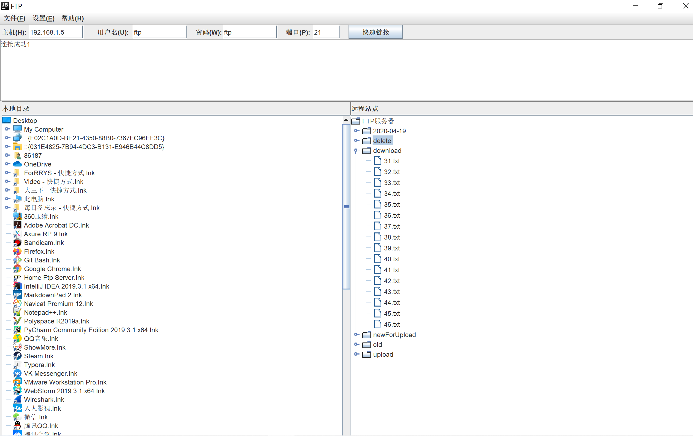

# FTP客户端

#### 开发人员

武汉大学软件工程专业2017级网络工程课程小组团队。-----20200401

#### 使用说明

上部的host等的输入框为了方便测试使用了默认值，可更改。

系统设置了默认的上传至和下载至的路径，可更改，数据通过配置文件存储。

下载的路径（本地路径）不存在会直接创建

上传的路径（服务器路径）分两个，一个是基础路径，基础路径因为使用的原因，配置文件会一直变，所以这边也没有改，但是如果没有基础路径的话，系统会提示先选择基础路径。

上传的路径除了基础路径，后面的路径是按照日期划分。

#### 系统截图

